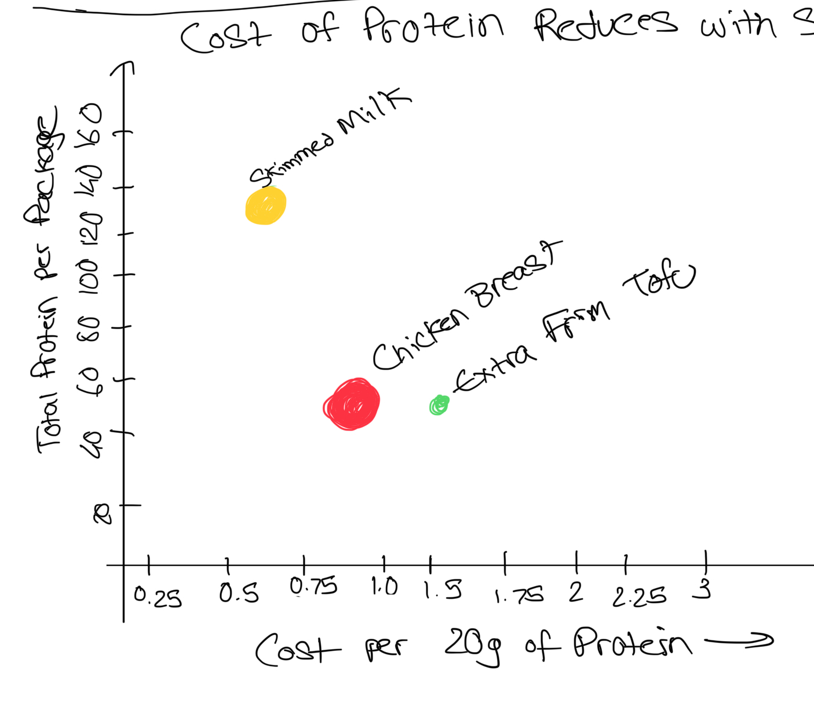
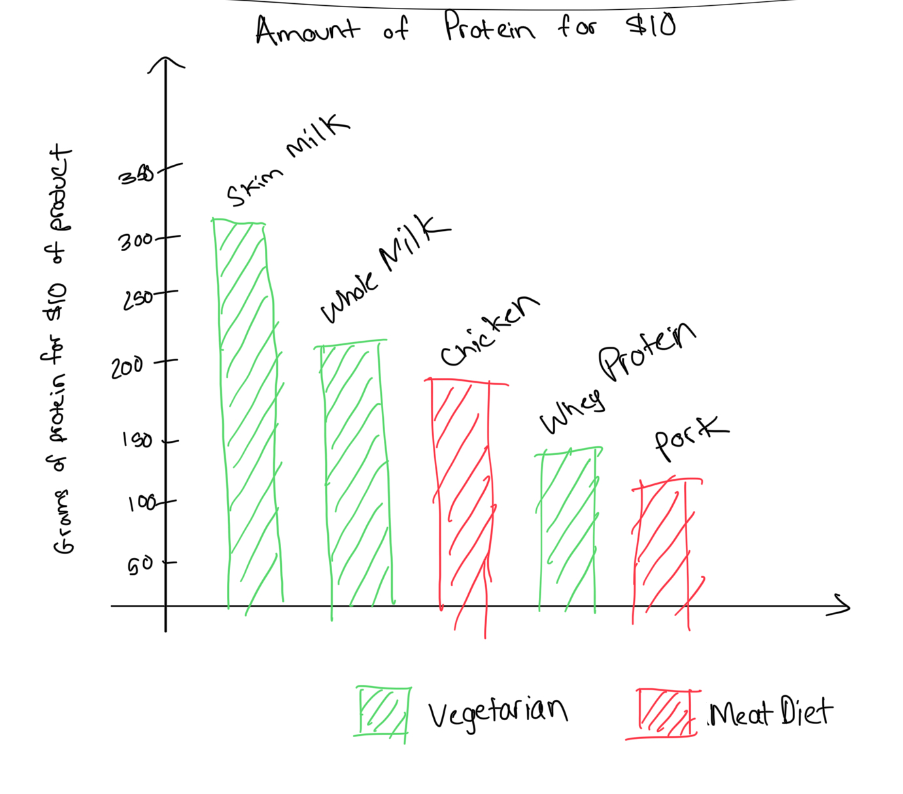

| [home page](/skalekar-portfolio-templates/) | [data viz examples](dataviz-examples) | [critique by design](critique-by-design) | [final project I](final-project-part-one) | [final project II](final-project-part-two) | [final project III](final-project-part-three) |

# Critique by Redesign

This assignment was an interesting one as I got utilize many of the skills I had learnt over the weeks in our **Telling Stories with Data Class**. In this assignment, we had to pick through the list of viz from the Makeover Monday website, where people post visualizations to critique by redesign. I found this as a great application of my understanding of visualizations!

## Step one: the visualization

URL: [https://data.world/makeovermonday/2023w8](https://data.world/makeovermonday/2023w8)

  

I chose to redesign [**The Cheapest Way to Get Your Protein**](https://data.world/makeovermonday/2023w8) from the Makeover Monday catalog, which was the viz that was put up on February 2, 2023. The reason I chose this particular viz after going through many was because I felt this was a viz which would be useful for me to understand as a person who is picky about my diet. I felt the viz was very relatable, but there were some things which could have improved my understanding and could benefit from a redesign.

## Step two: the critique

In this step, I actually decided to use both the critique method provided in the Good Charts book as well as the one provided in [Stephen Few's Data Visualization Effectiveness Profile](https://www.perceptualedge.com/articles/visual_business_intelligence/data_visualization_effectiveness_profile.pdf) as given through the Google Form. Through critiquing through both these processes, I gained further insight into how I felt about the project.

### Good Charts Method
I first listed down the things I thought of when I first looked at the viz, such as the title, the pictures and the calorie counts. It did give the idea of the viz being a measure of protein to cost.

I really liked the simple colors and the obvious title. It was easy on the eyes in that regard, depicting the data in a very simple way, which is always useful when it comes to getting information quick. The graph being a bar chart also made the simplicity apparent, as the idea should be clear with the data provided.

What I did not like as much was the mention of calorie counts, the pictures and the scale of the costs. The calorie counts especially throw you off, as it does not actually depict the value of the bar, despite annotating as if it is. The pictures also add nothing to the viz, as it is named below, adding a level of bloat to the otherwise simple graph. Finally, the scale itself I found very unintuitive, especially combined with the calorie counts. Even with the lines, it wasn't giving me any clean insights into how much it all costs, making it a bit disappointing.

I wish I saw some sort of marking or color change to mark which is the best protein or bang for your buck. I believe this graph in its current state is just data but it is not very intuitive to glean actual understanding of. The cost per 30g of Protein also confuses as you get the feeling that quorn is the best, even though it is the most expensive for 30g of protein.

Three things I felt which definitely needed to change were-
- Improve the scale or make it more detailed
- Remove the bloat such as the pictures which are not adding anything
- Use the calorie counts in a different way as it was too confusing in the original graph

### Stephen Few's Method
This method I used through the means of the Google form, which made it easy to understand what I was supposed to do.

**1. Usefulness-**

I feel the viz was useful in terms of the title as it told the story well, but the actual data itself needed a few moments to parse. With its scale being quite unintuitive to me personally, I felt that this viz was useful in terms of giving the idea but doesn't actually tell you the story as well outside of the title. However, if you put in some effort, it will be quite useful for those who care about their diet.

**2. Completeness-**

The data itself is pretty complete as it sets out to tell the story it wanted to tell, which is comparing the price of protein for different food sources. I believe it does give the idea and allows the user to actually gain complete insights. However, I personally think that maybe if we could somehow visualize how much is the smallest container of one of the protien sources would have made it more useful.

**3. Perceptibility-**

I believe this viz artist was onto something in terms of the bar chart being a simple yet effective way of showing the contents of the data, as it feels very easy to understand. However, there's too much extraneous elements like calorie counts and pictures which are very distracting, which is why I don't think it's the understandable viz.

**4. Truthfulness-**

The data itself is incredibly accurate, especially once compared to the dataset provided. There is the problem such as the calorie counts not even being present in the dataset, but otherwise, it is very truthful.

**5. Intuitiveness-**

As mentioned in perceptibility, there's a certain level of intuitiveness in this viz coming through the idea  of the bar chart and it being sorted. I can tell that the heights of the bar charts are important, though I misunderstood that height as at first glance I misunderstood the tallest being the least costly, even though that means its the most expensive. I think inversing the relationship would make it more intuitive.

**6. Aesthetics-**

I personally found the aesthetics of the viz just fine. It isn't rocking the boat, but it isn't the ugliest thing on Earth either. I would say that the simple bar chart is making it at least slightly pleasing on the eyes, but not by much.

**7. Engagement-**

This was not a very engaging viz for me, especially since it wasn't very useful in terms of actual shown data. The title itself is incredibly eye catching for those people who are on a diet, but other than that the information gets lost due to the number of distracting elements in the diagram itself.

**8. Describe your overall observations about the data visualization-**

The viz depicted is very striking to me through the title alone. As a person who is very careful about my diet, I found the title incredibly eye-capturing. The simple bar graph made it easy to see which foods have the highest cost as per the protein amount, though I would say on first glance I'd have thought it was a graph on cost per gram of protein. To me, the graph feels like it should be telling one story but it seems to be the exact opposite due to the way the sorting has been done. The pictures also seem a bit distracting and additional, since we already have the names, so it feels like we are just adding more components even though it's not required. I also feel the calorie accounts on the bar is distracting as it feels as if the data is mislabeled.

**9. Who is the target audience and is this an effective viz for reaching that audience?**

The primary audience seems to be people who are both fitness and budget conscious. The visualization seems to be effective in grabbing attention, but needs to be clearer about it's meaning since there seems to be a lot of extraneous components, as to get usable information needs some longer reading and parsing.

**10. What are you planning on redesigning?**

I plan on making the calorie counts useful as I feel as though it is misrepresented in this viz. I'll probably be trying a wide variety of categorized viz, trying to maintain the simplicity, as well as maybe using colors with a legend to better represent the data without overly distracting from the main idea for the target audience.

## Step three: Sketch a solution

Going into the sketches, I had a clear idea that I wanted to maybe add some more data in while still trying to keep the simplicity of the original. I used ChatGPT for some inspiration on what kind of diagrams would work for the dimensions I was looking for.

However, I did hit a pretty major snag. The problem was that the dataset given in Makeover Monday was not the same as the one used in the diagram, as it lacked information such as calorie counts for the food and had 'Cost of 20g of protein' instead of the 30g depicted in the viz. This meant my using of calorie as a metric went out the window, but the data itself was still pretty good, which is why I decided to keep moving forward with redesigning this viz.

I drew 2 sketches for this, both which had compelling yet different ideas on what story the data is telling.

### <u>Sketch 1</u>

  

Sketch 1 comes from the idea that the information is very less at the moment, and I had an interest in making the most of every column within the dataset. The dataset came in with fields such as if the food is classified as a vegetarian, vegan or meat based food, how much a package of the protein source costs and the total protein for a package. I felt as though I could use different colors to depict the food classification with red being meat, yellow being vegetarian and green being vegan, as that's the color scheme used in India. I also thought size of the points would be an interesting way to show cost per package. The two axes would be the 'Cost of 20g of Protein' and 'Total Protein per Package' as I felt though the relationship between the amount of protein within the package to the cost of protein would be a good indicator of what's bang for your buck.

### <u>Sketch 2</u>

  

After drawing sketch 1, I felt as though I had complicated it had WAAAY too much and decided to go with a simple minor redesign of the original viz. However, instead of the visualizing the 'Cost of 20g of a Protein Source', I decided to inverse the relationship and make it 'The Amount of Protein one gets for $10', as a person who goes to the gym, I'd want to know which gives the most protein for the cheapest possible price. It is a different way of looking at it, and it oddly makes it more intuitive to look at. I also colored the columns for this one to depict meat and vegetarian food options.

## Step four: Test the solution

Based on the visualization and the sketches I made, I decided to use many of the starter questions given in the assignment with a few minor tweaks. I wanted the questions to be a bit more personalized to the viz itself so I could gather more insights.

The questions I asked were: 

- Can you tell me what you think this is at first glance?

- Can you describe to me what you think it's trying to tell you?

- Do you think you're able to understand the story at first?

- Who do you think is the intended audience for this?

- Do you think the intended audience would find it useful?

- Is there anything you would change or do differently?

My interviewees were fellow classmates from my class-
- Interviewee 1 was a student from the MAM Program who had worked lightly in design
- Interviewee 2 was a student from the MISM program who had worked with data previously
- Interviewee 3 was also a student from the MISM program who was working on becoming a Product Manager

### Results: 

**Sketch 1**

| Question | Interviewee 1 | Interviewee 2 | Interviewee 3 |
|-----------|----------------|----------------|----------------|
| **Can you tell me what you think this is at first glance?** | Scatterplot depicting a relationship between protein and cost | Scatterplot about different foods | Food and protein relationship visualization |
| **Can you describe to me what you think it's trying to tell you?** | It seems to say that cost of 20g of protein is least for skimmed milk | The data seems to depict the amount of protein to its cost per 20g | The cost of protein to its unit rate |
| **Do you think you're able to understand the story at first?** | No, it is too complicated | It is difficult to parse | Feels too distracting |
| **Who do you think is the intended audience for this?** | People who care about fitness | People who are careful about diet | People who regularly go to the gym |
| **Do you think the intended audience would find it useful?** | No, since it is too difficult to parse | No, it is very distracting | Maybe, but it would be difficult to parse and get anything meaningful out of it |
| **Is there anything you would change or do differently?** | Make it simpler and change the colors so it is ADA compliant | Change the colors and make the reason for the size more obvious | Simplify and reduce the dimensions so as to make it more understandable. Maybe change the colors |

**Sketch 2**

| Question | Interviewee 1 | Interviewee 2 | Interviewee 3 |
|-----------|----------------|----------------|----------------|
| **Can you tell me what you think this is at first glance?** | Same as before | Same as before | Same as before |
| **Can you describe to me what you think it's trying to tell you?** | It seems to be showing the amount of protein in $5 of a food | Protein in $5 of food | Grams of protein in $5 of food |
| **Do you think you're able to understand the story at first?** | Yes, this is very simple to understand | Yes | Yes |
| **Who do you think is the intended audience for this?** | Same as before | Same as before | Same as before |
| **Do you think the intended audience would find it useful?** | Yes, as it shows which has the most protein for the cheapest price | Yes because it is easy to parse | Yes, it is simple to understand at a glance |
| **Is there anything you would change or do differently?** | Change the colors so it is ADA compliant, since the options of food choices is useful | Changing the colors would be useful again, as well as understanding how much the product cost on sale | Change the colors |

### Synthesis: 

From the interviews, I realized that my intuition on the first sketch being too complicated was correct, as those who read it felt it was too confusing for what it was. The size really made things difficult, and I also realized that the connection between all 3 elements I was depicting made little sense when you think outside the dataset.

Going back to the idea of the original viz and making a bar chart really improved the readability, especially when I removed the extraneous elements such as the calories and the pictures just as I planned. All 3 interviewees were able to easily understand the contents with the flipped axis, which was more intuitive as the scale was in hundreds over the USD. Making the cost static really accentuated the amount of protein we get in the foods, which is changing the story slightly but helped give the idea of cost vs quantity.

The colors being ADA compliant was one criticism I had anticipated. I had chosen red and green as in India, red labels are put on products which are 'non-vegetarian' and green labels are put on products which are 'vegetarian', with it being a common distinguisher between all packaged foods. For sketching I decided to use it to see how intuitive people would find it, which they did, but the problem still remained that it is not ADA compliant. Changing the colors so that I could keep the intuitive meaning while making it ADA compliant was an idea I would use when building the solution as well.

## Step five: build the solution

Through the synthesis phase, I learnt many things I could add into the diagram. However, many of the things I did add into the viz were through playing around with Tableau itself. I realized I could create calculated fields like I had planned for inversing the cost to protein ration as I had done previously, allowing me to add in the vegan, vegetarian and meat options into the same column. I also think by making the bar chart sideways, the readability would increase as well as space as most computer screens have longer widths than heights, allowing to fit the name of the product more easily.

Labeling the grams on the bars and removing the axis also helped as we can see the exact changes in protein. On the tooltip I decided to add some more extra information so one can make more educated guesses, while annotating the protein sources which have the cheapest and most expensive smallest package. I also removed all extra information so nothing appears twice or is redundant.

I changed the colors as that was a major feedback, trying to maintain the original idea of intuitive reading with being ADA compliant. I believe I came to a good color scheme which isn't too distracting and would be ADA compliant. I also added the feedback relating to the cost of package of the food source, as it would give the idea about what is in the budget to the person overall.

Finally, I kept a title such that when a person reads it they realize how to read the bars themselves, telling the story about which has the most protein for $5 (which I changed to show a smaller range of values).

<noscript></noscript><object class='tableauViz'  style='display:none;'><param name='host_url' value='https%3A%2F%2Fpublic.tableau.com%2F' /> <param name='embed_code_version' value='3' /> <param name='site_root' value='' /><param name='name' value='protein_costs&#47;Sheet4' /><param name='tabs' value='no' /><param name='toolbar' value='yes' /><param name='static_image' value='https:&#47;&#47;public.tableau.com&#47;static&#47;images&#47;pr&#47;protein_costs&#47;Sheet4&#47;1.png' /> <param name='animate_transition' value='yes' /><param name='display_static_image' value='yes' /><param name='display_spinner' value='yes' /><param name='display_overlay' value='yes' /><param name='display_count' value='yes' /><param name='language' value='en-GB' /><param name='filter' value='publish=yes' /><param name='filter' value='showOnboarding=true' /></object>

In the end, I am pretty happy with how the viz turned out, but will say that GitHub Pages is messing up the formatting of the annotation boxes more than expected. This was a fun assignment to work on, and I hope I get to do something like this again!

## References
- Good Charts Chapter 3, Chapter 4, Pages 114 - 118
- [2023/W8: The Cheapest Ways to Get Your Protein](https://data.world/makeovermonday/2023w8)
- [Data Visualization Effectiveness Profile](https://www.perceptualedge.com/articles/visual_business_intelligence/data_visualization_effectiveness_profile.pdf)

## AI acknowledgements

I used ChatGPT 5 Pro to ideate on the data I received. I did not use it to create anything, just push through ideas. I also used it as a user manual as I don't find Tableau as intuitive to use, so to do the things I wanted to do, I would ask ChatGPT.

