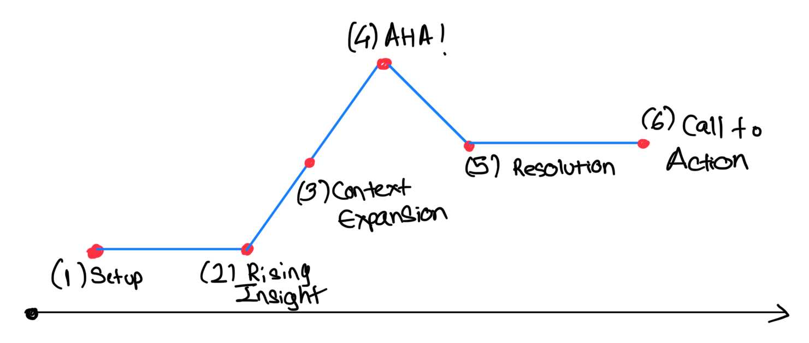
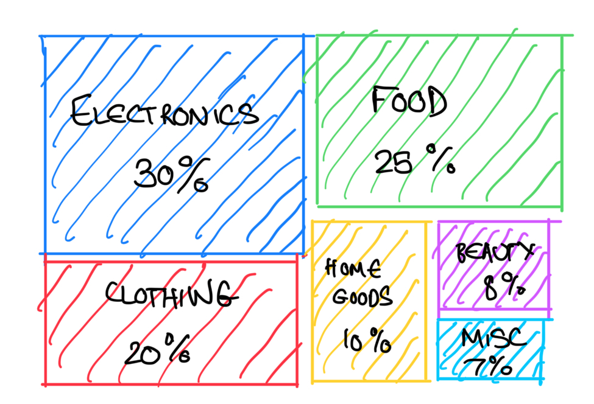
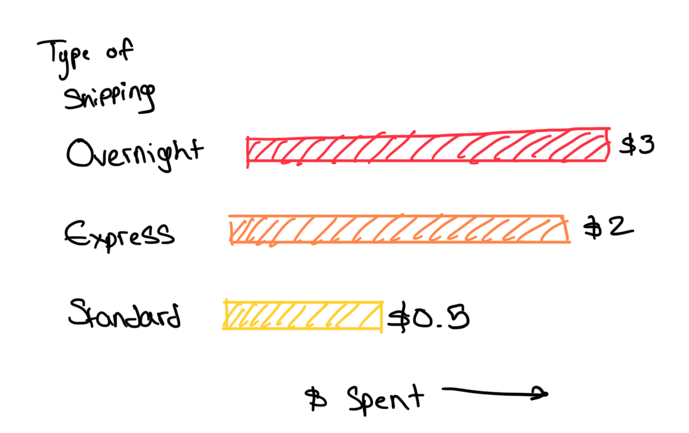

| [home page](https://cmustudent.github.io/tswd-portfolio-templates/) | [data viz examples](dataviz-examples) | [critique by design](critique-by-design) | [final project I](final_project_ShlokKalekar) | [final project II](final-project-part-two) | [final project III](final-project-part-three) |

# Outline

Being in a consumerist market such as the United States, we have endless options for shopping whether it be online or in stores, for essentials or for luxuries, on holidays, on late nights, and everything in between.
As a serial shopper myself, I feel compelled to understand not only my own shopping habits but compare them to consumer trends throughout the United States.  
The project at the moment explores an open question:

**What patterns can we discover from US shopping behavior and what can consumers learn about themselves from these patterns?**

**One-sentence summary:** This project explores how individual U.S. shopping choices - such as shipping preferences, spending habits, and category trends - reflect broader geographic and national consumer patterns, helping readers better understand their own behavior.

In this project, I aim to explore everyday shopping behavior from the perspective of the consumer rather than the retailer. Shopping is something we all do, often without much reflection, yet patterns emerge in how we choose shipping methods, how frequently we buy, which categories dominate our carts, and how much we actually spend. By examining these behaviors at both the individual and national level, I hope to uncover insights that help consumers recognize their own tendencies and understand how their choices fit within broader U.S. shopping trends.

This story is not meant to judge or critique consumerism, but to reveal the small, often invisible habits that shape the way we shop. Through a combination of transactional data, geographic patterns, seasonal spending trends, and national industry context, I plan to build a narrative that helps readers see themselves in the data. Ultimately, this exploration may offer a clearer picture of why we shop the way we do—and how a better awareness of these patterns could support more intentional, mindful decision-making.

## Project Structure

I've drawn a storytelling arc for now with broad strokes. I will likely be adding more graphs as I explore the topic further.

**(1) Setup: Curiosity about everyday shopping decisions**  
I introduce the idea that we shop constantly, often without noticing the small decisions we make such as what we buy, how often, how much, and how we choose to receive it. This builds curiosity about the invisible patterns behind everyday consumer behavior.

**(2) Rising Insight: Early patterns from the shopping dataset**  
I begin exploring broad behavioral trends in the primary dataset, such as how different categories, spending levels, or shopping habits appear across consumers. These early signals help the audience start seeing structure in what otherwise feels like random personal choices.

**(3) Contextual Expansion: Bringing in geographic and national patterns**  
I incorporate state-level and national datasets to compare these individual behaviors with larger patterns across the United States. This helps show whether trends in the primary dataset align with or differ from broader economic, regional, or seasonal consumer behaviors.

**(4) AHA Moment: Understanding the bigger picture**  
This is where the audience starts connecting personal habits to the wider consumer landscape. The combination of micro-level (individual) and macro-level (national) data enables a clearer understanding of why certain patterns might emerge.

**(5) Resolution: Interpreting what the patterns might mean**  
The story moves into reflection and explains what the observed patterns could suggest about how and why people shop the way they do. The resolution does not prescribe answers but helps readers interpret their behavior within a larger context.

**(6) Call to Action: Encouraging mindful and informed consumption**  
The narrative ends by showing how readers can use these insights to think more intentionally about their shopping choices, from spending habits to shipping preferences.

---

## Initial sketches

**1. Category Spending Treemap**  
This sketch gives a general overview of how relative spending breaks down in the United States based on broad shopping categories. It reflects the insights of Act 1 and 2 where I begin introducing behavioral patterns.  

**2. Shipping Type vs Spend Bar Chart**  
This sketch illustrates how much consumers spend depending on shipping type. With many people having subscriptions like Amazon Prime, shipping behavior becomes important context for Act 3 or 4.  

**3. US Choropleth Spending Map**  
This sketch is a rough representation of spending differences across states. This visualization could be used early in Act 3 to reveal geographic variation, or later in Act 4 as supporting context for national trends.  

---

# The data

For this project, I plan to use a combination of primary and secondary datasets that together help illustrate US consumer shopping behavior.

My primary dataset is a transactional shopping behavior dataset sourced from Kaggle. It includes variables such as item purchased, amount spent, shipping choice, category, frequency of purchases, subscription status, and demographic fields such as age and location. This dataset provides the behavioral patterns needed for the core of the story.

To supplement this, I will incorporate several publicly accessible datasets to provide geographic and national context.  
DataUSA’s Electronic Shopping (NAICS 454110) profile offers industry-level metrics including revenue growth, employment, and state-level differences.  
DataCommons provides demographic, economic, and income indicators that help explain geographic variation in shopping behavior.  
I am also using a holiday gift-spending dataset from Makeover Monday, which provides seasonal and long-term context for how Americans allocate holiday spending over time.  
If useful, Google Trends will reveal how public interest in online shopping has shifted.  

Together, these datasets provide both micro-level behavioral detail and macro-level national patterns that help frame the broader consumer landscape.

| Name | URL | Description |
|------|-----|-------------|
| **Shopping Behavior Dataset (Primary)** | [https://www.kaggle.com/datasets/saadaliyaseen/shopping-behaviour-dataset](https://www.kaggle.com/datasets/saadaliyaseen/shopping-behaviour-dataset) | Individual-level shopping behavior including category, spend, shipping type, frequency, subscription status, age, and location. Main dataset for behavioral insights. |
| **Holiday Gift Spending (Makeover Monday 2022 Week 52)** | [https://data.world/makeovermonday/2022w52](https://data.world/makeovermonday/2022w52) | Annual US holiday gift spending by category (family, friends, coworkers, other), used for seasonal and long-term national spending trends. |
| **DataUSA – Electronic Shopping (NAICS 454110)** | [https://datausa.io/profile/naics/electronic-shopping](https://datausa.io/profile/naics/electronic-shopping) | Industry-level trends including revenue, employment, state-level performance, and digital access context. |
| **Google DataCommons – United States** | [https://datacommons.org/place/country/USA](https://datacommons.org/place/country/USA) | State-level demographic, income, and economic indicators for geographic comparison and context. |
| **Google Trends** | [https://trends.google.com](https://trends.google.com) | Public interest over time for search terms like “online shopping.” |

---

# Method and medium

I will complete my final project using a mix of Tableau, Datawrapper, and Shorthand.  
Tableau will mostly be used for analytical and complex visualizations such as maps, scatterplots, and comparative charts.  
Datawrapper will maybe be used for clean, publication-ready charts such as bar charts, donut charts, and annotated visuals. I will probably see what works best between the Tableau and Datawrapper when creating viz, but will mostly focus on using Tableau.  
The final narrative will be built in Shorthand as an interactive, scroll-based story that integrates visuals, text, and transitions.

---

## References

Berinato, S. (2016). *Good Charts: The HBR Guide to Making Smarter, More Persuasive Data Visualizations*. Harvard Business Review Press.

Kaggle. (n.d.). *Shopping Behaviour Dataset*. https://www.kaggle.com/datasets/saadaliyaseen/shopping-behaviour-dataset

Makeover Monday. (2022). *2022 Week 52: Holiday Gift Spending*. https://data.world/makeovermonday/2022w52

DataUSA. (n.d.). *Electronic Shopping (NAICS 454110)*. https://datausa.io/profile/naics/electronic-shopping

Google DataCommons. (n.d.). *United States Statistical Data*. https://datacommons.org/place/country/USA

Google Trends. (n.d.). *Google Trends Explorer*. https://trends.google.com

## AI acknowledgements
I used AI (ChatGPT 5.1) to assist in ideation for the project and refining the text for Part I. All storytelling and sketches have been done by me.
